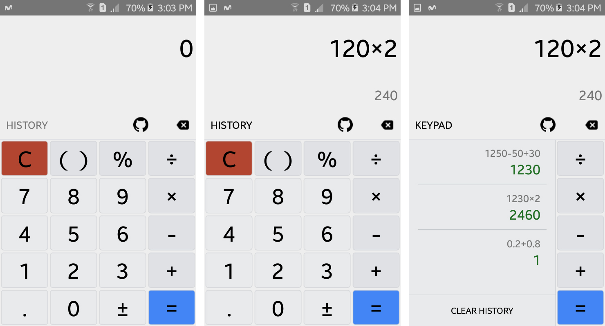

# React Native Calculator
Calculadora Basica con React Native

* Aprendiendo un poco mas de react y react native
* Aprendiendo a manejar el estado de react, creando algunos componentes, pasando props a los componentes

Para correr está aplicación debes tener todo el entorno de React Native instalado [Mira como hacerlo](https://facebook.github.io/react-native/docs/getting-started.html)

Luego solo `$ npm install` y luego `$ react-native run-android` o `$ react-native run-ios` recuerda tener un emulador prendido previamente si quieres correr la aplicación en Android.

[Tambien puedes ver el proyecto en Expo](https://snack.expo.io/@luisalbertoi/calculator)

####Capturas de pantalla
\*literal asterisks\*

